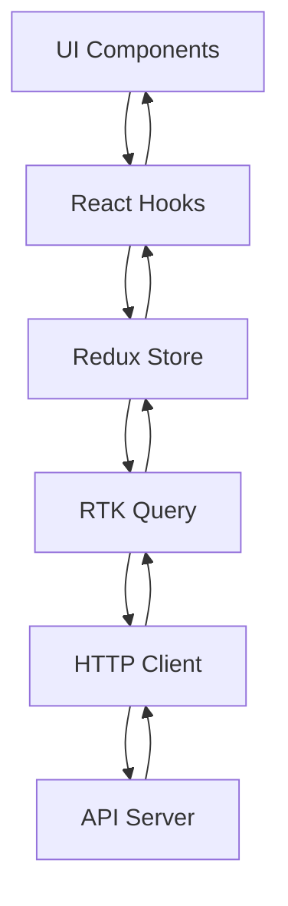

# React Native Boilerplate

<div align="center">
  <h3>Production-Grade React Native Boilerplate</h3>
  <p>Built with Expo, TypeScript, Redux Toolkit, and comprehensive tooling</p>
</div>

## 📋 Table of Contents

- [Purpose](#-purpose)
- [Key Features](#-key-features)
- [Tech Stack](#-tech-stack)
- [Getting Started](#-getting-started)
- [Project Structure](#-project-structure)
- [Available Scripts](#-available-scripts)
- [Environment Variables](#-environment-variables)
- [Architecture](#-architecture)
- [EAS Build Configuration](#-eas-build-configuration)
- [Testing](#-testing)
- [Contributing](#-contributing)
- [License](#-license)

## 🎯 Purpose

This boilerplate provides a solid foundation for building production-ready React Native applications. It includes:

- **Enterprise-ready architecture** with clear separation of concerns
- **Type-safe development** with TypeScript strict mode
- **State management** with Redux Toolkit and RTK Query
- **Authentication flow** with secure token storage
- **UI component library** with theming support
- **Quality gates** including linting, testing, and type checking
- **CI/CD pipelines** for automated testing and building

## ✨ Key Features

### Core Features
- 📱 **Expo SDK 50** with bare workflow capability
- 🎨 **Design System** with light/dark theme support
- 🔐 **Authentication** with secure storage (expo-secure-store)
- 🧭 **Navigation** using React Navigation (native-stack + bottom-tabs)
- 🔄 **State Management** with Redux Toolkit and RTK Query
- 📝 **Form Handling** with react-hook-form and Zod validation
- 🌐 **HTTP Client** with Axios (interceptors, auth injection, refresh logic)

### Developer Experience
- 🔍 **TypeScript** with strict mode configuration
- 🎭 **Storybook** for component development and documentation
- ✅ **Testing** with Jest and React Native Testing Library
- 🎨 **Code Quality** with ESLint and Prettier
- 🪝 **Git Hooks** with Husky and lint-staged
- 📦 **CI/CD** with GitHub Actions

## 🛠 Tech Stack

### Core
- **React Native** 0.73.4
- **Expo** ~50.0.0
- **TypeScript** ^5.3.3
- **React** 18.2.0

### Navigation
- **@react-navigation/native** ^6.1.9
- **@react-navigation/native-stack** ^6.9.17
- **@react-navigation/bottom-tabs** ^6.5.11

### State Management
- **@reduxjs/toolkit** ^2.0.1
- **react-redux** ^9.0.4
- **RTK Query** (included in Redux Toolkit)

### Forms & Validation
- **react-hook-form** ^7.49.2
- **zod** ^3.22.4
- **@hookform/resolvers** ^3.3.4

### HTTP & Storage
- **axios** ^1.6.2
- **expo-secure-store** ~12.8.1

### Development Tools
- **ESLint** ^8.56.0
- **Prettier** ^3.1.1
- **Jest** ^29.7.0
- **@testing-library/react-native** ^12.4.2
- **Storybook** ^7.6.0
- **Husky** ^8.0.3
- **lint-staged** ^15.2.0

## 🚀 Getting Started

### Prerequisites

- Node.js 18+ 
- npm or yarn
- iOS Simulator (Mac only) or Android Studio
- Expo CLI (will be installed automatically)

### Installation

1. **Clone the repository**
   ```bash
   git clone https://github.com/niksbanna/ReactNative-Boilerplate.git
   cd ReactNative-Boilerplate
   ```

2. **Install dependencies**
   ```bash
   npm install
   ```

3. **Set up environment variables**
   ```bash
   cp .env.example .env
   # Edit .env with your configuration
   ```

4. **Start the development server**
   ```bash
   npm start
   ```

5. **Run on a device**
   - Press `i` for iOS simulator
   - Press `a` for Android emulator
   - Scan QR code with Expo Go app for physical device

### Using as a Template

This repository is configured as a GitHub template. To create your own project:

1. Click "Use this template" on GitHub
2. Create a new repository
3. Clone your new repository
4. Update `app.json` with your app name and identifiers
5. Update `package.json` with your project details

## 📁 Project Structure

```
ReactNative-Boilerplate/
├── app/                      # Application source code
│   ├── components/          # Reusable UI components
│   │   ├── Button.tsx
│   │   ├── Text.tsx
│   │   ├── Input.tsx
│   │   ├── Card.tsx
│   │   ├── *.stories.tsx    # Storybook stories
│   │   └── __tests__/       # Component tests
│   ├── navigation/          # Navigation configuration
│   │   ├── RootNavigator.tsx
│   │   ├── AuthNavigator.tsx
│   │   └── MainNavigator.tsx
│   ├── screens/            # Screen components
│   │   ├── auth/           # Authentication screens
│   │   └── main/           # Main app screens
│   ├── services/           # API and utility services
│   │   ├── api.ts          # Axios HTTP client
│   │   └── storage.ts      # Secure storage service
│   ├── store/              # Redux store configuration
│   │   ├── index.ts        # Store setup
│   │   ├── hooks.ts        # Typed Redux hooks
│   │   ├── slices/         # Redux slices
│   │   └── services/       # RTK Query services
│   ├── theme/              # Design system
│   │   ├── tokens.ts       # Design tokens
│   │   └── ThemeContext.tsx
│   └── types/              # TypeScript type definitions
├── assets/                 # Static assets (images, fonts)
├── scripts/                # Utility scripts
│   └── seed.ts            # Mock data seeding
├── .github/               # GitHub configuration
│   └── workflows/         # CI/CD workflows
├── .storybook/            # Storybook configuration
├── docs/                  # Additional documentation
├── App.tsx               # App entry point
├── app.json              # Expo configuration
├── eas.json              # EAS Build configuration
├── tsconfig.json         # TypeScript configuration
├── jest.config.js        # Jest configuration
├── babel.config.js       # Babel configuration
├── .eslintrc.js          # ESLint configuration
├── .prettierrc           # Prettier configuration
└── package.json          # Dependencies and scripts
```

## 📜 Available Scripts

### Development
```bash
npm start                 # Start Expo development server
npm run android          # Run on Android emulator
npm run ios              # Run on iOS simulator
npm run web              # Run in web browser
```

### Quality Assurance
```bash
npm run lint             # Run ESLint
npm run lint:fix         # Fix ESLint issues
npm run format           # Format code with Prettier
npm run type-check       # Run TypeScript type checking
npm test                 # Run tests
npm run test:watch       # Run tests in watch mode
npm run test:coverage    # Run tests with coverage report
```

### Storybook
```bash
npm run storybook        # Start Storybook server
npm run build-storybook  # Build Storybook for production
```

### Utilities
```bash
npm run seed             # Run seed script (mock data)
```

## 🔐 Environment Variables

Create a `.env` file based on `.env.example`:

```env
# API Configuration
API_BASE_URL=https://jsonplaceholder.typicode.com
API_TIMEOUT=10000

# Environment
NODE_ENV=development

# Feature Flags
ENABLE_DEV_TOOLS=true
ENABLE_LOGGING=true
```

### Using Environment Variables

Access environment variables in your code:
```typescript
const apiUrl = process.env.API_BASE_URL;
```

## 🏗 Architecture

### Data Flow



### Navigation Flow

```
RootNavigator (Auth Gate)
├── AuthNavigator (when not authenticated)
│   ├── LoginScreen
│   ├── RegisterScreen
│   └── ForgotPasswordScreen
└── MainNavigator (when authenticated)
    ├── HomeScreen (Tab)
    └── ProfileScreen (Tab)
```

### Authentication Flow

1. **App Launch**: Check for stored auth token
2. **If token exists**: Restore user session → Navigate to Main
3. **If no token**: Show Auth screens
4. **Login/Register**: Store token + user data → Update Redux → Navigate to Main
5. **Logout**: Clear token + user data → Navigate to Auth

### State Management

- **Redux Toolkit** for global state (auth, user preferences)
- **RTK Query** for server state (API data caching and synchronization)
- **React Hook Form** for local form state
- **Theme Context** for theme state

## 📱 EAS Build Configuration

This project is configured for EAS Build with three profiles:

### Build Profiles

1. **Development** (`eas build --profile development`)
   - Development client enabled
   - Internal distribution
   - iOS simulator build
   - Android APK

2. **Preview** (`eas build --profile preview`)
   - Internal distribution
   - iOS device build
   - Android APK

3. **Production** (`eas build --profile production`)
   - Store-ready builds
   - iOS App Store
   - Android AAB for Google Play

### App Identifiers

- **iOS Bundle ID**: `com.niksbanna.reactnativeboilerplate`
- **Android Package**: `com.niksbanna.reactnativeboilerplate`

### EAS Setup

1. Install EAS CLI:
   ```bash
   npm install -g eas-cli
   ```

2. Login to Expo:
   ```bash
   eas login
   ```

3. Configure project:
   ```bash
   eas build:configure
   ```

4. Build for platform:
   ```bash
   eas build --platform ios --profile development
   eas build --platform android --profile development
   ```

## 🧪 Testing

### Running Tests

```bash
# Run all tests
npm test

# Run tests in watch mode
npm run test:watch

# Generate coverage report
npm run test:coverage
```

### Test Structure

Tests are co-located with components in `__tests__` directories:

```
app/components/
├── Button.tsx
└── __tests__/
    └── Button.test.tsx
```

### Writing Tests

Example test:
```typescript
import { render } from '@testing-library/react-native';
import { Button } from '../Button';

test('renders button with title', () => {
  const { getByText } = render(
    <Button title="Click me" onPress={() => {}} />
  );
  expect(getByText('Click me')).toBeTruthy();
});
```

## 🤝 Contributing

Please read [CONTRIBUTING.md](CONTRIBUTING.md) for details on our code of conduct and the process for submitting pull requests.

### Development Workflow

1. Create a feature branch from `main`
2. Make your changes
3. Run linters and tests
4. Commit using conventional commits
5. Push and create a pull request

### Code Quality

Pre-commit hooks automatically run:
- ESLint (with auto-fix)
- Prettier (formatting)
- Type checking

## 📄 License

This project is licensed under the MIT License - see the LICENSE file for details.

## 🙏 Acknowledgments

- **Expo Team** for the amazing framework
- **Redux Team** for Redux Toolkit
- **React Navigation** for navigation solution
- **Community** for open-source contributions

## 📞 Support

For issues and questions:
- Open an [issue on GitHub](https://github.com/niksbanna/ReactNative-Boilerplate/issues)
- Check [documentation](./docs)
- Review [Known Issues](./docs/KNOWN_ISSUES.md) for common problems and solutions

## ⚠️ Known Issues

See [docs/KNOWN_ISSUES.md](./docs/KNOWN_ISSUES.md) for information about:
- Security audit warnings (Expo SDK dependencies)
- Test coverage thresholds
- CI/CD configuration notes
- Production readiness checklist

## 🔄 Versioning

We use [SemVer](http://semver.org/) for versioning:
- **MAJOR** version for incompatible API changes
- **MINOR** version for backwards-compatible functionality
- **PATCH** version for backwards-compatible bug fixes

### Release Process

1. Update version in `package.json` and `app.json`
2. Update CHANGELOG.md
3. Create a git tag: `git tag -a v1.0.0 -m "Release 1.0.0"`
4. Push tag: `git push origin v1.0.0`
5. Create GitHub Release with notes

---

<div align="center">
  <p>Built with ❤️ by <a href="https://github.com/niksbanna">Nikhil Banna</a></p>
</div>