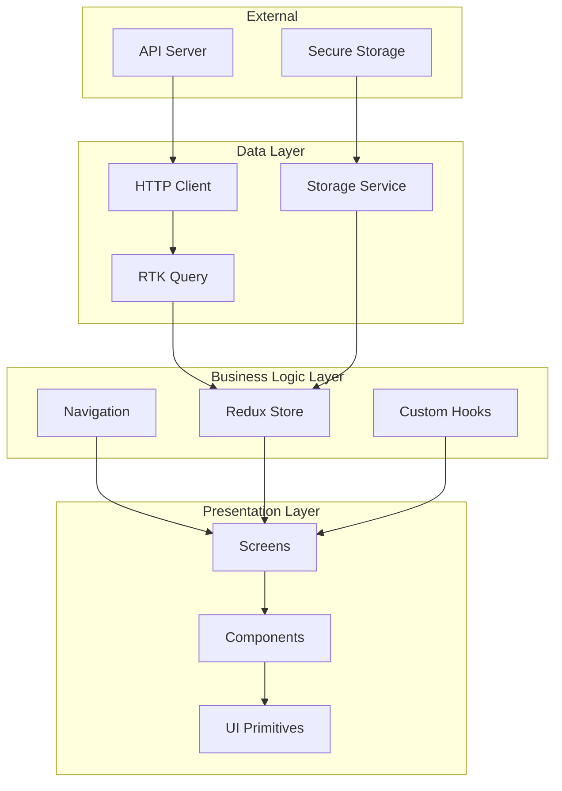
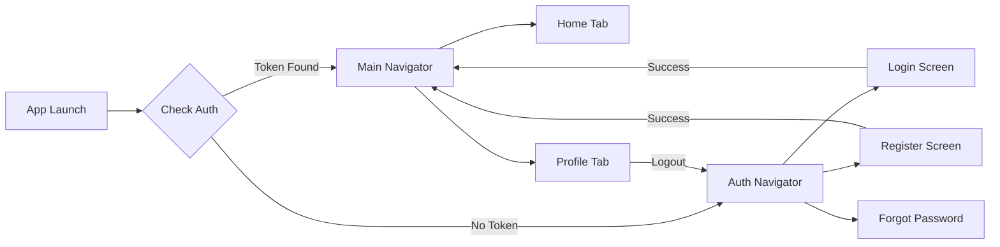
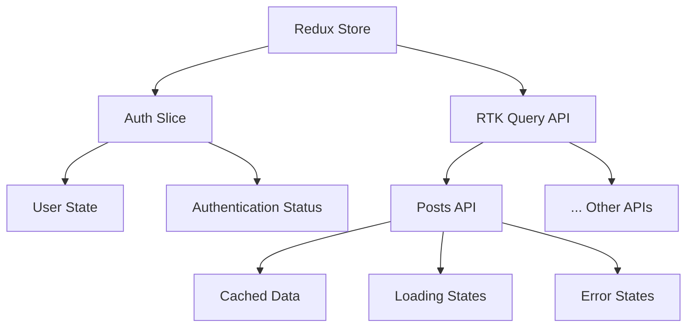
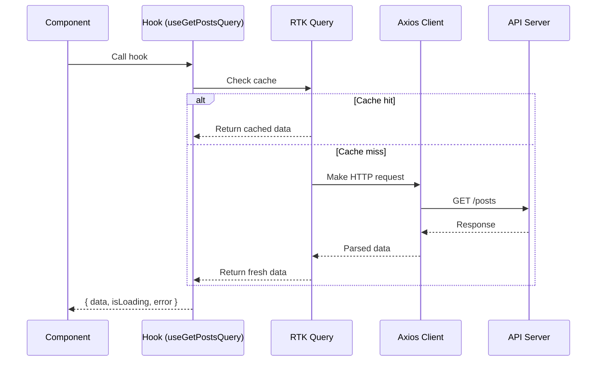
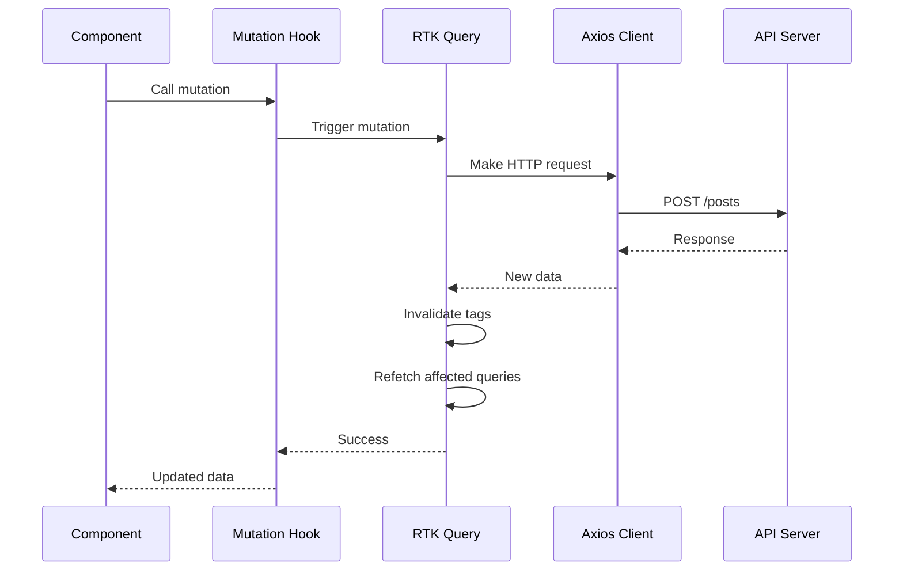
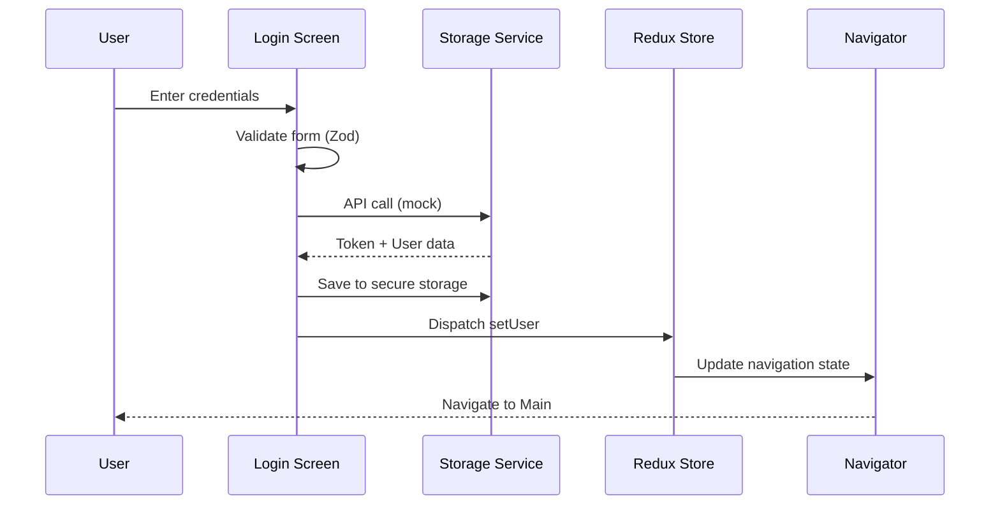
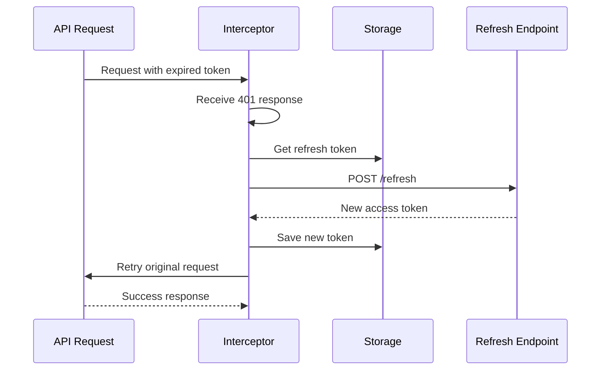
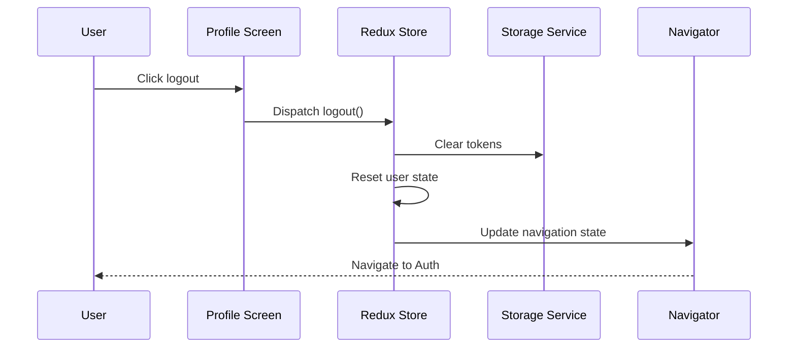
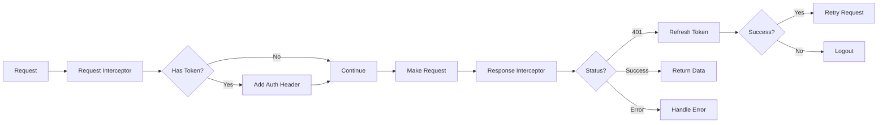
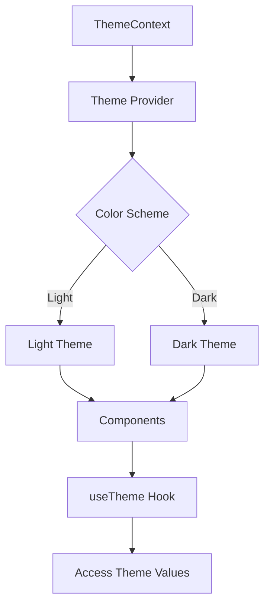

# Architecture Overview

This document provides a detailed overview of the React Native Boilerplate architecture.

## Table of Contents

- [High-Level Architecture](#high-level-architecture)
- [Navigation Flow](#navigation-flow)
- [State Management](#state-management)
- [Data Flow with RTK Query](#data-flow-with-rtk-query)
- [Authentication Flow](#authentication-flow)
- [Component Architecture](#component-architecture)

## High-Level Architecture



## Navigation Flow

### Root Navigator (Auth Gate)

The application uses a root navigator that implements an authentication gate pattern:



### Navigation Structure

```
RootNavigator
├── AuthNavigator (Stack)
│   ├── Login
│   ├── Register
│   └── ForgotPassword
└── MainNavigator (Tabs)
    ├── Home
    └── Profile
```

## State Management

### Redux Store Architecture



### State Structure

```typescript
{
  auth: {
    user: User | null,
    isAuthenticated: boolean,
    isLoading: boolean
  },
  postsApi: {
    queries: {
      'getPosts()': { data, status, error },
      'getPost(1)': { data, status, error }
    },
    mutations: {}
  }
}
```

## Data Flow with RTK Query

### Query Flow



### Mutation Flow



## Authentication Flow

### Login Flow



### Token Refresh Flow



### Logout Flow



## Component Architecture

### Component Hierarchy

```
App
├── Provider (Redux)
│   └── ThemeProvider
│       └── SafeAreaProvider
│           └── NavigationContainer
│               └── RootNavigator
│                   ├── AuthNavigator
│                   │   └── LoginScreen
│                   │       ├── Input (with react-hook-form)
│                   │       └── Button
│                   └── MainNavigator
│                       └── HomeScreen
│                           ├── Card
│                           └── Text
```

### Component Design Pattern

All UI components follow a consistent pattern:

```typescript
// Component receives theme from context
const Component = ({ prop1, prop2 }) => {
  const { theme } = useTheme();
  
  return (
    <View style={[
      styles.container,
      { backgroundColor: theme.colors.background }
    ]}>
      {/* Content */}
    </View>
  );
};
```

### Form Handling

Forms use react-hook-form with Zod validation:

```typescript
const schema = z.object({
  email: z.string().email(),
  password: z.string().min(6)
});

const { control, handleSubmit } = useForm({
  resolver: zodResolver(schema)
});
```

## HTTP Client Architecture

### Axios Interceptor Flow



### Request/Response Pipeline

1. **Request Phase**
   - Retrieve access token from storage
   - Inject Authorization header
   - Log request in development

2. **Response Phase**
   - Log response in development
   - Handle 401 errors (token refresh)
   - Return data or propagate error

## Theme System

### Theme Architecture



### Theme Tokens

- **Colors**: Primary, secondary, background, text, etc.
- **Spacing**: xs, sm, md, lg, xl, xxl
- **Typography**: Font sizes, weights, line heights
- **Border Radius**: sm, md, lg, xl, full
- **Shadows**: sm, md, lg

## Testing Architecture

### Test Structure

```
Component/Feature
├── Component.tsx
├── Component.test.tsx (Unit tests)
├── Component.stories.tsx (Storybook)
└── __integration__/
    └── Feature.test.tsx (Integration tests)
```

### Testing Layers

1. **Unit Tests**: Individual components and functions
2. **Integration Tests**: Component interactions and flows
3. **E2E Tests**: (Not included, but can be added)

## Security Considerations

### Token Storage

- Uses expo-secure-store for encrypted storage
- Tokens never stored in AsyncStorage or plain text
- Refresh token flow placeholder included

### API Security

- HTTPS only in production
- Request signing (can be added)
- Rate limiting (server-side)

### Input Validation

- Client-side validation with Zod
- Server-side validation required
- XSS prevention via React's built-in escaping

## Performance Optimizations

### React Optimizations

- Functional components with hooks
- React.memo for expensive components
- useCallback for event handlers
- useMemo for computed values

### Data Fetching

- RTK Query automatic caching
- Optimistic updates for mutations
- Background refetching
- Cache invalidation strategies

### Bundle Size

- Tree shaking enabled
- Code splitting (can be added)
- Image optimization
- Font subsetting

## Scalability Considerations

### Adding New Features

1. Create feature folder under `app/features/`
2. Add RTK Query service if needed
3. Create screens and components
4. Add navigation routes
5. Write tests

### Adding New API Endpoints

1. Define types in `app/types/`
2. Add endpoints to RTK Query service
3. Use hooks in components
4. Handle loading and error states

### Environment-Specific Config

- `.env.development`
- `.env.staging`
- `.env.production`

Each environment can have different:
- API base URLs
- Feature flags
- Analytics keys
- Logging levels
